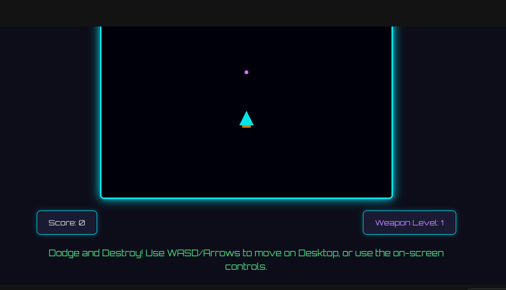

# 🌌 Galactic Defender

**Galactic Defender** is a fast-paced, classic-style **2D vertical space shooter** built using **pure HTML, CSS (Tailwind), and Vanilla JavaScript**.  
Pilot your ship, dodge incoming asteroids, destroy enemies, upgrade your weapons, and survive as long as you can!

---

## 🚀 Live Demo

▶️ **Play Now:** https://mohakamran.github.io/space-game/  
Experience the game instantly — no installation required!

---

## 📸 Screenshot Preview



*A glimpse of the Galactic Defender gameplay.*

---

## ✨ Features

- **Responsive Gameplay** — Fully optimized for desktop, tablet, and mobile devices.
- **Dual Control Scheme**  
  - Desktop: Arrow Keys / WASD  
  - Mobile/Tablet: On-screen D-pad
- **Progressive Difficulty** — Enemies become faster and more frequent over time.
- **Weapon Upgrade System** — Hit score milestones to increase fire rate and unlock **Triple-Shot**.
- **Real-Time Statistics** — Live score and weapon level display.
- **Neon Aesthetic** — Bright neon visuals on a dark space backdrop.

---

## 🕹️ How to Play

### **Controls**

| Device        | Action       | Input                         |
|---------------|--------------|-------------------------------|
| Desktop       | Move Ship    | W / A / S / D or Arrow Keys   |
| Desktop       | Pause Game   | P                             |
| Mobile/Tablet | Move Ship    | On-Screen D-Pad               |
| All Devices   | Fire         | Automatic                     |

---

### **Objective**

- **Pilot:** Move your ship to avoid asteroids and enemies.  
- **Destroy:** Your ship fires automatically — destroy enemies to earn points.  
- **Upgrade:** Reach score milestones to boost fire rate and unlock spread shots.  
- **Survive:** The game ends on collision with an enemy.

---

## 💻 Technology Stack

- **HTML5** — Canvas rendering & structure  
- **CSS3 (Tailwind CSS)** — Styling, layout, mobile responsiveness  
- **JavaScript (Vanilla JS)** — Core game logic, input handling, physics  

---

## ⚙️ Local Setup & Installation

### 1. Clone the Repository

```bash
git clone https://github.com/mohakamran/space-game.git
cd space-game
